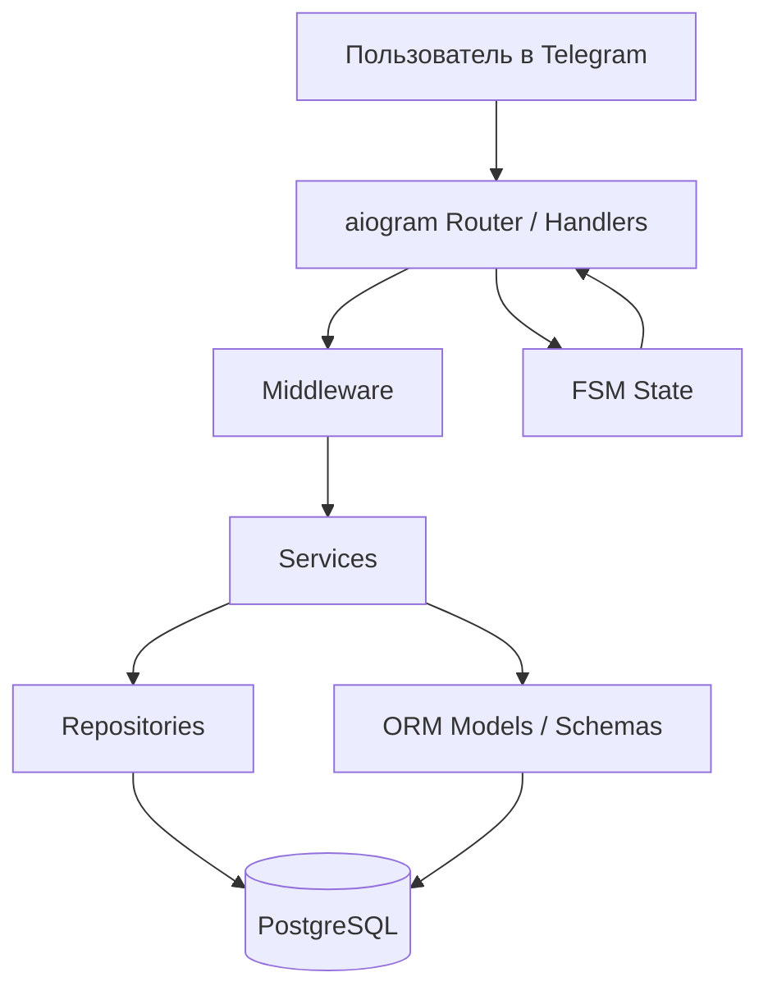
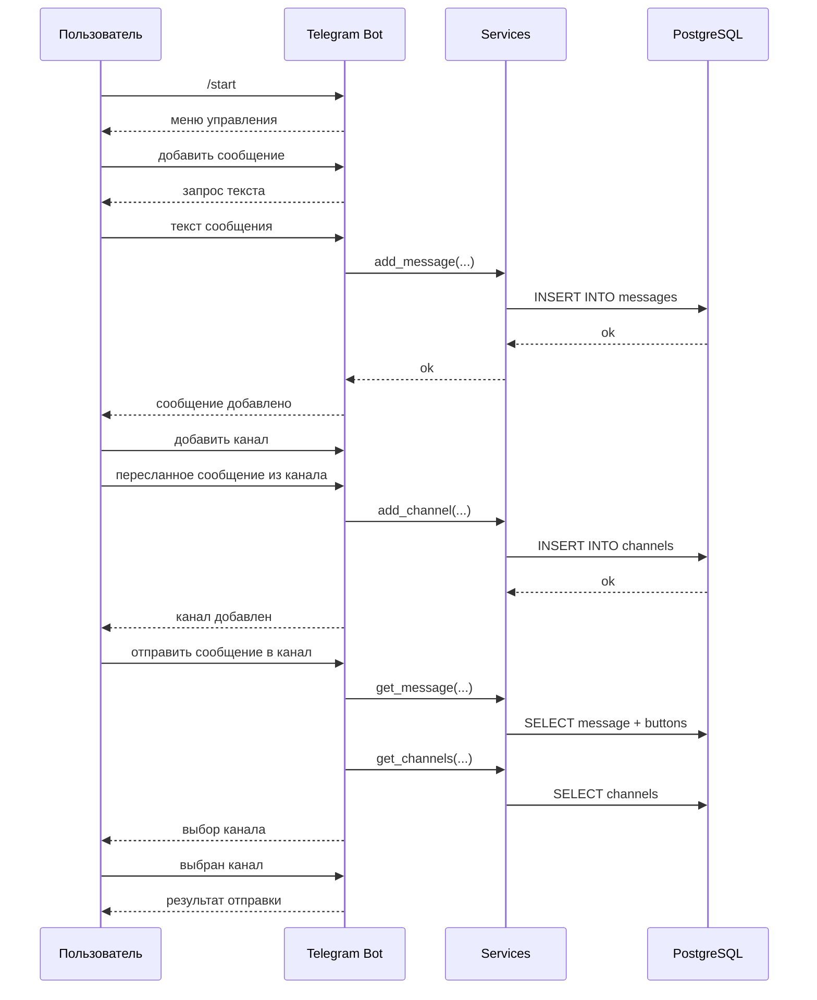
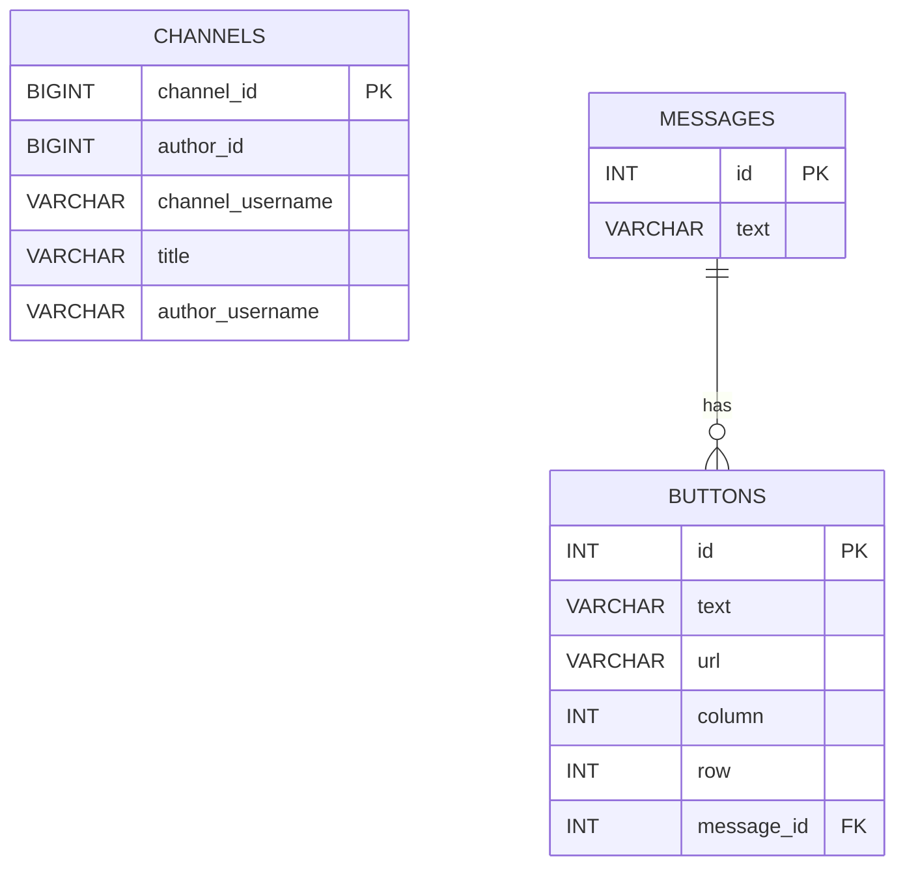

# tg-bot-message-orchestrator

Telegram-бот для управления шаблонными сообщениями и каналами, в которые эти сообщения отправляются.

Бот позволяет:
- хранить сообщения в базе данных;
- добавлять к сообщениям inline-кнопки со ссылками;
- хранить список Telegram-каналов;
- отправлять выбранное сообщение в выбранный канал;
- управлять всем этим через Telegram-интерфейс.

## Возможности

Сейчас в боте реализованы такие сценарии:
- добавить сообщение;
- удалить сообщение;
- открыть сообщение для дальнейших действий;
- добавить кнопку к сообщению;
- удалить кнопку у сообщения;
- добавить канал через пересланное сообщение;
- удалить канал;
- отправить выбранное сообщение в выбранный канал.

Управление построено через inline-кнопки и FSM-состояния `aiogram`.

## Стек

- Python 3.12
- `aiogram 3`
- `SQLAlchemy 2`
- `asyncpg`
- `Alembic`
- PostgreSQL
- Docker / Docker Compose
- `uv`

## Структура проекта

```text
src/
  bot/         Telegram-бот, роутеры, middleware, кнопки, тексты, состояния
  core/        конфигурация, интерфейсы, инициализация сервисов и бота
  db/          ORM-модели и репозитории
  services/    бизнес-логика поверх репозиториев
alembic/       миграции базы данных
```

## Переменные окружения

Пример лежит в [.env.example](/home/deogen/Documents/tg-bot-message-orchestrator/.env.example:1).

Нужны такие переменные:

```env
BOT__TOKEN=1234567890:replace_me
BOT__ALLOWED_USERS=[123456789]
POSTGRES_HOST_PORT=5433
DATABASE__HOST=postgres
DATABASE__PORT=5432
DATABASE__USER=postgres
DATABASE__PASSWORD=postgres
DATABASE__DATABASE=tg_bot
```

Пояснения:
- `BOT__TOKEN` - токен Telegram-бота от `@BotFather`;
- `BOT__ALLOWED_USERS` - список Telegram ID, которым разрешён доступ к боту;
- `POSTGRES_HOST_PORT` - внешний порт контейнера PostgreSQL на сервере; если `5432` уже занят, оставь `5433`;
- `DATABASE__*` - настройки подключения к PostgreSQL.

## Локальный запуск

### 1. Установить зависимости

```bash
uv sync
```

### 2. Подготовить `.env`

```bash
cp .env.example .env
```

После этого заполнить реальные значения.

### 3. Применить миграции

```bash
uv run alembic upgrade head
```

### 4. Запустить бота

```bash
uv run python -m src.main
```

## Работа с миграциями

Применить все миграции:

```bash
uv run alembic upgrade head
```

Откатить последнюю миграцию:

```bash
uv run alembic downgrade -1
```

Создать новую миграцию вручную:

```bash
uv run alembic revision -m "describe_change"
```

Создать миграцию по изменениям моделей:

```bash
uv run alembic revision --autogenerate -m "describe_change"
```

Текущая стартовая миграция создаёт таблицы:
- `channels`
- `messages`
- `buttons`
- `alembic_version`

## Docker

### Сборка

```bash
docker compose build
```

### Запуск

```bash
docker compose up -d
```

Контейнер PostgreSQL внутри `docker compose` продолжает слушать `5432`, но на хост публикуется порт из `POSTGRES_HOST_PORT`, по умолчанию `5433`. Это позволяет запускать проект даже если системный PostgreSQL на сервере уже использует `5432`.

### Логи

```bash
docker compose logs -f bot
docker compose logs -f postgres
```

### Остановка

```bash
docker compose down
```

### Остановка с удалением volume базы

```bash
docker compose down -v
```

## Как работает запуск в Docker

Контейнер `bot` стартует через [docker-entrypoint.sh](/home/deogen/Documents/tg-bot-message-orchestrator/docker-entrypoint.sh:1):

1. выполняет `alembic upgrade head`;
2. при `RUN_MIGRATIONS_ONLY=1` завершает работу после миграций;
3. иначе запускает `python -m src.main`.

Это гарантирует, что схема БД обновлена до старта приложения.

## Схема работы



## Пользовательский сценарий



## Модель данных



## Таблицы БД

### `messages`

Хранит шаблоны сообщений.

Поля:
- `id` - идентификатор сообщения;
- `text` - текст сообщения до `4096` символов.

### `buttons`

Хранит кнопки, привязанные к сообщению.

Поля:
- `id` - идентификатор кнопки;
- `text` - текст кнопки;
- `url` - ссылка кнопки;
- `column` - позиция кнопки по колонке;
- `row` - позиция кнопки по ряду;
- `message_id` - ссылка на сообщение.

Одна запись `messages` может иметь много записей `buttons`.

### `channels`

Хранит каналы, доступные для отправки сообщений.

Поля:
- `channel_id` - Telegram ID канала;
- `author_id` - Telegram ID пользователя, добавившего канал;
- `channel_username` - username канала, если есть;
- `title` - название канала;
- `author_username` - username пользователя, добавившего канал.

## Полезные команды

Проверить синтаксис проекта:

```bash
./.venv/bin/python -m compileall src alembic
```

Проверить итоговый Docker Compose-конфиг:

```bash
docker compose config
```

Прогнать только миграции в контейнере:

```bash
docker compose run --rm -e RUN_MIGRATIONS_ONLY=1 bot
```

## Текущее ограничение

Кнопка `Заменить текст` уже есть в интерфейсе, но обработчик изменения текста сообщения пока не реализован. Остальные основные сценарии, перечисленные выше, работают.
